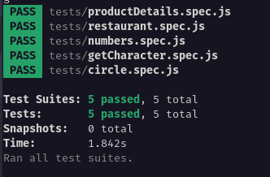

# JavaScript Unit tests



# Índice

* [Título e Imagens Home](#javascript-unit-tests)
* [tecnologias utilizadas](#tecnologias-utilizadas)
* [Descrição do projeto](#descrição-do-projeto)
* [Status do Projeto](#status-do-projeto)
* [Acesso ao Projeto](#acesso-ao-projeto)

# Tecnologias utilizadas


# Descrição do Projeto

O projeto "JavaScript Unit tests" é parte do currículo da formação de Desenvolvedor Web da [Trybe](https://www.betrybe.com/). Nesse projeto, os alunos têm a oportunidade de aplicar seus conhecimentos em JavaScript e Jest para a criação de Testes unitários.

# Status do Projeto

> 💹 Alpha 💹

# Acesso ao projeto

Para acessar e executar este projeto, siga os passos abaixo:

1. Certifique-se de ter o Node.js e o npm instalados em sua máquina.

2. Clone o Projeto

```bash
git clone https://github.com/EversonDias/Project_Trybe_JavaScript_and_Jest_JavaScript_Unit_Tests.git JsUnitTest
```

3. Entre no projeto

```bash
cd JsUnitTest
```

4. instale as Dependências

```bash
npm install
```

5. inicie o projeto

```bash
npm test
```
